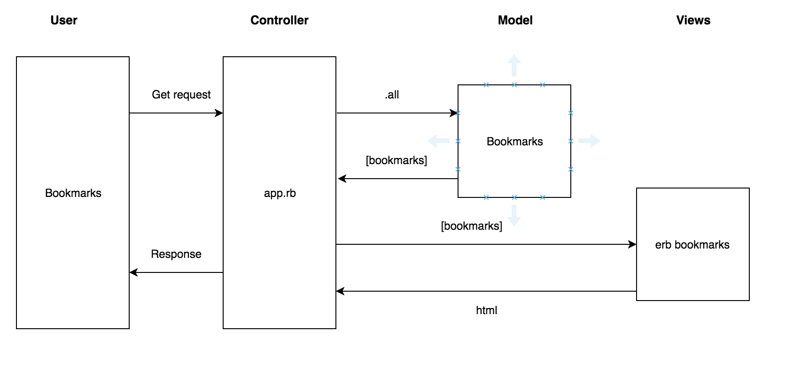

# bookmark-manager


```
As a  time-pressed user
I want to see a list of bookmarks
So that I can access them

As a time-pressed user
So that I can save a website
I would like to add the site's address and title to bookmark manager
```


